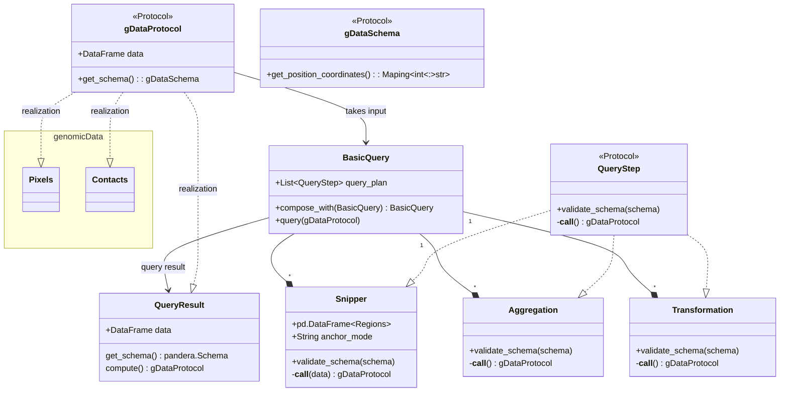

# Interface query

This document defines the high-level interface of the spoc query engine.

## Class relationships



## Description

- __gDataProtocol__: Protocol class that defines the interface of genomic data that can be accepted by `BasicQuery`. Implements a method to get it's schema as well as a parameter to get the underlying data
- __BasicQuery__: Central query class that encapsulates querying an object that implements the `gDataProtocol`. Holds references to a query plan, which is a list of filters, aggregations and transformations that are executed in order and specify the filtering, aggregation and transformation operations. Is composable with other basic query instances to capture more complex queries. Performs checks on the proposed operations based on the `get_schema()` method and the requested filters and aggregations.
- __QueryResult__: Result of a BasicQuery that implements the `gDataProtocol` and can either be computed, which manifests the query in memory, or passed to basic query again.
- __Filter__: Interface of a filter that is accepted by `BasicQuery` and encapsulates filtering along rows of genomic data.
- __Snipper__: A filter that filters for overlap with specific genomic regions that are passed to the constructor. Anchor refers to the way that the genomic regions are overlapped (e.g. at least one, exactly one, all, the first contact etc.)

## Examples

Example pseudocode for selected usecases.

### Selecting a subset of contacts at a locus for display

```python
from spoc.query_engine import Snipper, Anchor, BasicQuery
from spoc.contacts import Contacts
import pandas as pd

# load input
target_region = pd.read_csv("single_test_region.bed")
contacts = Contacts.from_uri("test_contacts.spoc::2")

# specify query plan -> Select contacts where all contacts overlap the
#                       specified region
query_plan = [
    Snipper(target_region, anchor_mode=Anchor(mode="ALL"))
]

# instantiate query
query = BasicQuery(query_plan=query_plan)

# execute query

result = queyr.query(contacts)
result
#|> QueryResult

result.data
#|> duckdb.DuckDBPyrelation # not executed yet

result.compute()
#|> pd.DataFrame # executed
```

### Pileup of trans triplets

#### CC by T

Select 2d cis-pixels that are anchored by a trans contact

```python
from spoc.query_engine import (
            Snipper,
            PointFilter,
            Anchor, 
            BasicQuery,
            RegionOffsetTransformation,
            Aggregation,
            AggregationMode
)
from spoc.pixels import Pixels
from spoc.utils import get_center_bin
import pandas as pd

# load input
target_regions = pd.read_csv("multiple_test_regions.bed")
target_regions_mid_points = get_center_bin(target_regions, bin_size=10_000)
# triplet pixels of AAB where binary lables have been equested and symmetry has
# been flipped
pixels = Pixels.from_uri("test_pixels.spoc::10000::3::AAB")

############################################
#### option 1: specify entire query plan####
############################################

query_plan = [
    # select pixels where all bins in a triplet are contained in a region
    Snipper(target_regions, anchor_mode=Anchor(mode="ALL", contacs=[0,1])),
    # select pixels where the third contact overlaps a specific bin
    Snipper(target_regions_mid_points, anchor_mode=Anchor(mode="ALL", contacs=[2])),
    # this transformation calculates the offset of a pixel to any containing target region
    RegionOffsetTransformation(target_regions),
    # this aggregation computes the sum of contacts per region and 2d coordinate
    Aggregation(function='sum', mode=AggregationMode(['Region', 'Contact1', 'Contact2'])),
    # this aggregation computes the average contacts per region contact1 and contact2 over all regions
    Aggregtaion(function='average', mode=AggregationMode(['Contact1', 'Contact2']))
]

# instantiate query
query = BasicQuery(query_plan=query_plan)

# execute query

result = queyr.query(contacts)
result
#|> QueryResult

############################################
#### option 2: compose pieces           ####
############################################

query_plan_1 = [
    Snipper(target_regions, anchor_mode=Anchor(mode="ALL", contacs=[0,1])),
    Snipper(target_regions_mid_points, anchor_mode=Anchor(mode="ALL", contacs=[2])),
    RegionOffsetTransformation(target_regions),
    Aggregation(function='sum', mode=AggregationMode(['Region', 'Contact1', 'Contact2'])),
]

query1 = BasicQuery(query_plan=query_plan_1)

query_plan_2 = [
    Aggregtaion(function='average', mode=AggregationMode(['Contact1', 'Contact2']))
]

query2 = BasicQuery(query_plan=query_plan_2)

# composing queries concatenates query plans

composed_query = query1.compose_with(query2)
composed_query.query_plan
#|> query_plan = [
#|>    Snipper(target_regions, anchor_mode=Anchor(mode="ALL", contacs=[0,1])),
#|>    Snipper(target_regions_mid_points, anchor_mode=Anchor(mode="ALL", contacs=[2])),
#|>    RegionOffsetTransformation(target_regions),
#|>    Aggregation(function='sum', mode=AggregationMode(['Region', 'Contact1', 'Contact2'])),
#|>    Aggregtaion(function='average', mode=AggregationMode(['Contact1', 'Contact2']))
#|> ]
```