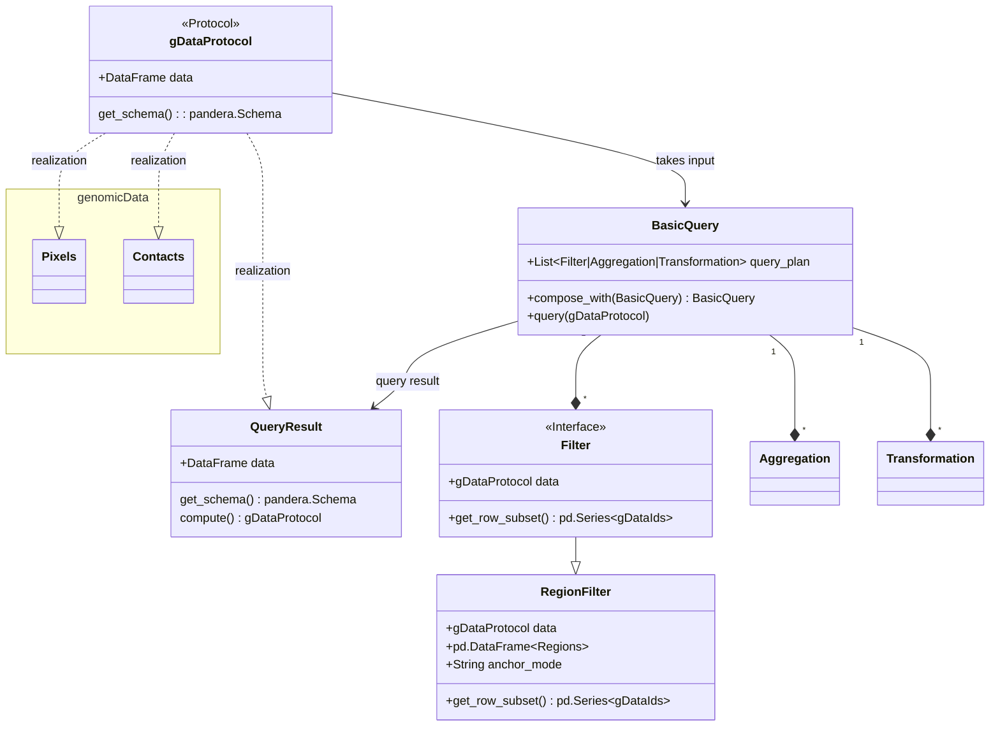

# Interface query

This document defines the high-level interface of the spoc query engine.

## Class relationships

## Description

- __gDataProtocol__: Protocol class that defines the interface of genomic data that can be accepted by `BasicQuery`. Implements a method to get it's schema as well as a parameter to get the underlying data
- __BasicQuery__: Central query class that encapsulates querying an object that implements the `gDataProtocol`. Holds references to a query plan, which is a list of filters, aggregations and transformations that are executed in order and specify the filtering, aggregation and transformation operations. Is composable with other basic query instances to capture more complex queries. Performs checks on the proposed operations based on the `get_schema()` method and the requested filters and aggregations.
- __QueryResult__: Result of a BasicQuery that implements the `gDataProtocol` and can either be computed, which manifests the query in memory, or passed to basic query again.
- __Filter__: Interface of a filter that is accepted by `BasicQuery` and encapsulates filtering along rows of genomic data.
- __RegionFilter__: A filter that filters for overlap with specific genomic regions that are passed to the constructor. Anchormode refers to the way that the genomic regions are overlapped (e.g. at least one, exactly one, all, the first contact etc.)