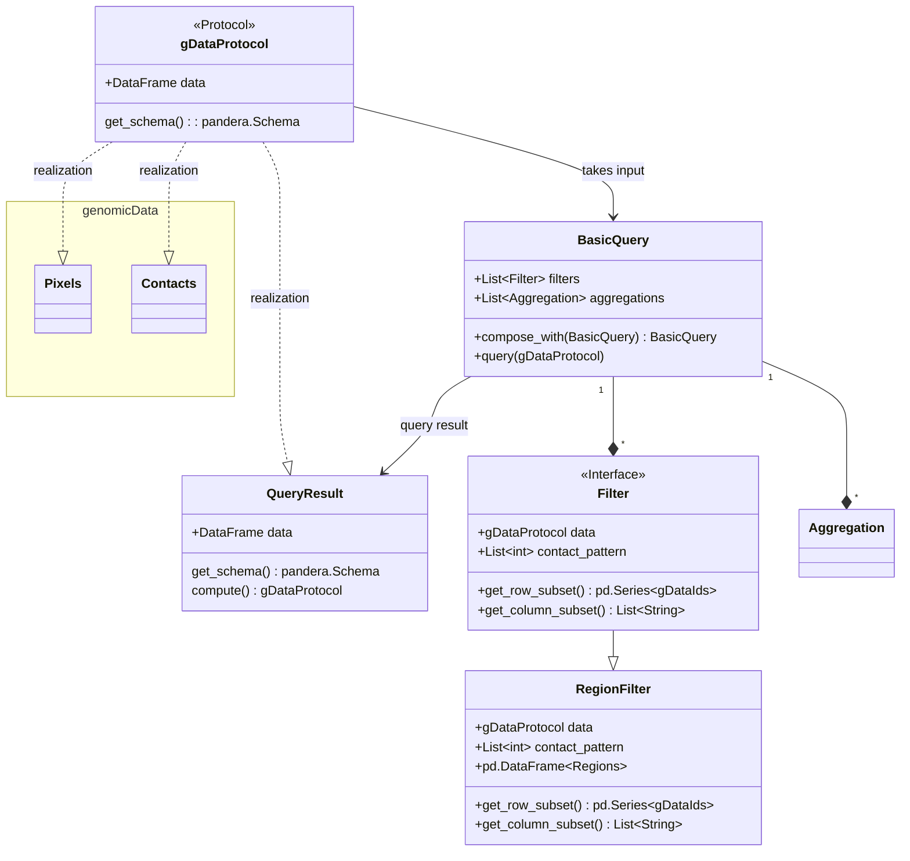

# Interface query

This document defines the high-level interface of the spoc query engine.

## Class relationships

```mermaid
classDiagram
namespace genomicData {
    class Pixels
    class Contacts
    } 

    class gDataProtocol{
        <<Protocol>>
        +DataFrame data
        get_schema(): pandera.Schema
    }

    class BasicQuery
        BasicQuery: +List~Filter~ filters
        BasicQuery: +List~Aggregation~ aggregations
        BasicQuery: +compose_with(BasicQuery) BasicQuery
        BasicQuery: +query(gDataProtocol)

    BasicQuery --> QueryResult : query result
    BasicQuery "1" --* "*" Filter
    BasicQuery "1" --* "*" Aggregation
    gDataProtocol --> BasicQuery : takes input
    gDataProtocol ..|> Pixels : realization
    gDataProtocol ..|> Contacts : realization
    gDataProtocol ..|> QueryResult : realization
    Filter --|> RegionFilter

    class Filter {
        <<Interface>>
        +gDataProtocol data
        +List~int~ contact_pattern
        +get_row_subset() pd.Series~gDataIds~
        +get_column_subset() List~String~
    }

    class RegionFilter {
        +gDataProtocol data
        +List~int~ contact_pattern
        +pd.DataFrame~Regions~
        +get_row_subset() pd.Series~gDataIds~
        +get_column_subset() List~String~
    }
        

    class Aggregation

    class QueryResult
        QueryResult: +DataFrame data
        QueryResult: get_schema() pandera.Schema
        QueryResult: compute() gDataProtocol
```
