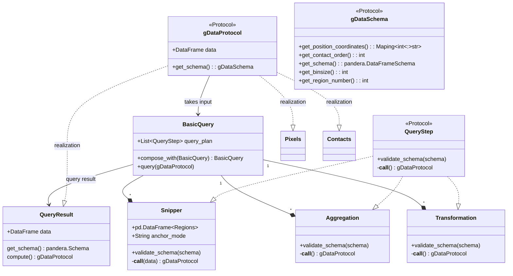

# Interface query

This document defines the high-level interface of the spoc query engine.

## Class relationships



## Description

- __gDataProtocol__: Protocol class that defines the interface of genomic data that can be accepted by `BasicQuery`. Implements a method to get it's schema as well as a parameter to get the underlying data
- __gDataSchema__: Schema protocol that incorporates interfaces to getting information about the genomic data.
- __BasicQuery__: Central query class that encapsulates querying an object that implements the `gDataProtocol`. Holds references to a query plan, which is a list of filters, aggregations and transformations that are executed in order and specify the filtering, aggregation and transformation operations. Is composable with other basic query instances to capture more complex queries. Performs checks on the proposed operations based on the `get_schema()` method and the requested filters and aggregations.
- __QueryResult__: Result of a BasicQuery that implements the `gDataProtocol` and can either be computed, which manifests the query in memory, or passed to basic query again.
- __Filter__: Interface of a filter that is accepted by `BasicQuery` and encapsulates filtering along rows of genomic data.
- __Snipper__: A filter that filters for overlap with specific genomic regions that are passed to the constructor. Anchor refers to the way that the genomic regions are overlapped (e.g. at least one, exactly one, all, the first contact etc.)

## Conceptual examples

Example pseudocode for selected usecases that are planned to be implemented. For usecases that have already been implemented see [the usage description of the query engine](query_engine_usage.md).

### Subsetting triplets (3-way contacts) on multiple overlaps

This use cases has the goal of counting the number of cis-sister contacts that form a loop, while simultaneously contacting their respective loop base on the other sister chromatid. This is a very complex use case and can be broken down into smaller steps as follows:

- Load a target set of contacts containing the required fragment level information
   - In this case, we are interested in triplets that have their sister identify annotated, and where binary labels have been equated (see [data structures page for more info](data_structures.md)). We are interested both in all cis contacts (AAA labeling state) and triplets containing a trans contact (AAB labeling state) since we want to quantify the number of target triplets amongst all triplets
- We now split the different labeling state into two analysis flows that run in a paraelel:
- The case for AAA
    - We perform multi-region annotation on the entire contacts, where we annotate the contacts on whether they overlap with loop bases (the two regions used are the left and the right loop bases).
    - We filter the contacts on whether they overlap at least with one loop base
    - We add a contact level annotation on whether a loop is present (overlap count =2)
    - We add a contact level annotation that indicates "no-trans interaction"
- The case for AAB
    - We perform the same analysis as for AAA, only for the contacts AA.
    - We add a contact level annotation on whether a loop is present (overlap count =2)
    - We add a contact level annotation that indicates "trans interaction"
- We concatenate the two contacts
- We aggregate by the contact level annotations on whether a loop is present and whether a a trans-contact has been observed and count the contacts an all the 4 combinations.


```python
from spoc.query_engine import (
    Snipper,
    MultiAnchor,
    Anchor,
    BasicQuery,
    MultiSnipper,
    FieldLiteral,
    Concatenate,
    Aggregate,
    AggregationFunction
)
from spoc.contacts import Contacts
import pandas as pd

# load contacts

cis_triplets = Contacts.from_uri("contacts::2::AAA")
trans_trans = Contacts.from_uri("contacts::2::AAB")

# load loop bases

loop_bases_left = pd.read_csv('loop_base_left.bed', sep="\t")
loop_bases_right = pd.read_csv('loop_base_right.bed', sep="\t")

# analysis cis_triplets

query_plan_cis = [
    MultiSnipper(
        regions=[loop_bases_left, loop_bases_right], # Regions to overlap
        add_overlap_columns=False, # Whether to add the regions as additional columns
        anchor=MultiAnchor(
            fragment_mode="ANY",
            region_mode="ANY", positions=[0,1,2]
        ), # At least one fragment needs to overlap at least one region
    ),
    FieldLiteral(field_name="is_trans", value=False)
]

cis_filtered = BasicQuery(query_plan_cis)\
                        .query(cis_triplets)

# analysis trans_triplets

query_plan_trans = [
    MultiSnipper(
        regions=[loop_bases_left, loop_bases_right], # Regions to overlap
        add_overlap_columns=False, # Whether to add the regions as additional columns
        anchor=MultiAnchor(
            fragment_mode="ANY",
            region_mode="ANY", positions=[0,1]
        ), # At least one fragment needs to overlap at least one region
    ),
    FieldLiteral(field_name="is_trans", value=True)
]

trans_filtered = BasicQuery(query_plan_trans)\
                        .query(trans_triplets)


# merge contacts and aggregate

query_plan_aggregate = [
    Concatenate(trans_filtered),
    Aggregate(fields=['overlap_count', 'is_trans'], function=AggregationFunction.Count)
]

result = BasicQuery(query_plan_aggregate)\
                  .query(cis_filtered)\
                  .load_result()
>
-----------------------------------
| overlap_count | is_trans | count |
|---------------|----------|-------|
| 1             | 0        | 1000  |
| 1             | 1        | 5000  |
| 2             | 0        | 100   |
| 2             | 1        | 50000 |
-----------------------------------

```


